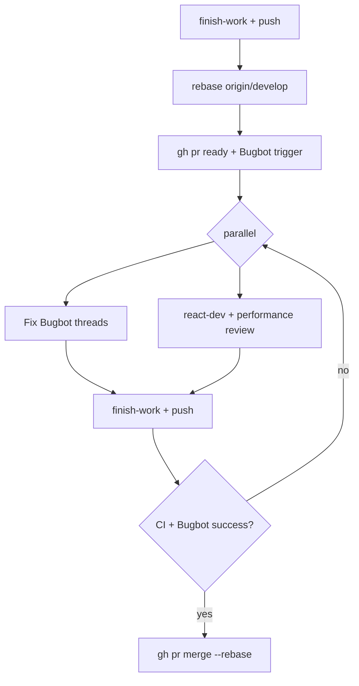

# Babysit (land a feature PR)

Orchestration skill for **your** feature branch PR — not Dependabot (`review-dependabot`). Default merge target: **`develop`** (confirm `baseRefName`; some repos use `main`).

Copy and track:

```
- [ ] Phase 1 — finish-work (check, commit, push)
- [ ] Phase 2 — rebase on latest develop
- [ ] Phase 3 — PR ready + Bugbot queued
- [ ] Phase 4a — Bugbot findings → fix → finish-work → reply/resolve
- [ ] Phase 4b — parallel code review (react-dev + performance) → fix
- [ ] Phase 5 — merge gate (CI, Bugbot, threads, rebase clean)
- [ ] Phase 6 — rebase merge
```

Large work: follow `@orchestrator-worker` — delegate discovery to `explore`, edits to `/implementer`, skeptical pass to `/verifier`.

## Prerequisites

- Feature branch pushed; PR exists (create with `ManagePullRequest` if missing).
- GitHub CLI (`gh`) authenticated in the repo root **without `--repo`**.
- Read [.cursor/CLOUD.md](../../../.cursor/CLOUD.md) for PR/issue **attribution** (`Written by :robot_face: <model-name>:`).

## Phase 1 — finish-work

Read and run skill [`finish-work`](../finish-work/SKILL.md):

1. `bun run check` until green (fix root cause, not symptoms).
2. Commit with finish-work message format; include `Ping <pr-url>` in the body when a PR is open.
3. **Push** (`git push -u origin <branch>`). Babysit always pushes — finish-work alone may stop before push.

UI/routing/auth/map changes: also run `bun run test:e2e` (or project `check-full`) per finish-work / `playwright-skill`.

## Phase 2 — rebase on develop

```bash
git fetch origin develop
git rebase origin/develop
```

- Conflicts: fix, `git add`, `git rebase --continue`, then **Phase 1** again (check + commit if needed + push).
- After rebase: `git push --force-with-lease` (branch was rebased).

Refresh PR base if wrong: `gh pr edit <number> --base develop`.

## Phase 3 — mark ready and trigger Bugbot

```bash
gh pr ready <number>   # exit draft
```

**Trigger Bugbot** (pick one; prefer least noisy):

| Situation | Action |
| --------- | ------ |
| Auto-review on push enabled | Push from Phase 1/2 is enough — wait |
| “Only when mentioned” / no run after push | Post a **new top-level** PR comment: `bugbot run` (or `cursor review`) — **not** a reply in a thread |
| Enterprise + `CURSOR_API_KEY` with admin scope | `POST https://api.cursor.com/bugbot/review` with `prUrl`; save `request_id` |

**Do not** rely on `@cursor review` inside a review-thread reply — Bugbot ignores it.

### Wait for Bugbot

Poll until the latest run finishes:

```bash
gh pr checks <number> --watch
gh pr view <number> --json statusCheckRollup,reviewDecision
```

GitHub check name: **`Cursor Bugbot`**.

| Check conclusion | Meaning |
| ---------------- | ------- |
| `success` | No issues, no unresolved Bugbot threads from earlier runs |
| `neutral` | Findings, cancelled by newer commit, or internal error — **treat as needs work** until threads resolved |
| `failure` | Unresolved findings when fail-on-unresolved is enabled |

Also list open review threads:

```bash
gh api graphql -f query='
  query($owner:String!, $repo:String!, $pr:Int!) {
    repository(owner:$owner, name:$repo) {
      pullRequest(number:$pr) {
        reviewThreads(first:100) { nodes { isResolved path line comments(first:1){nodes{author{login} body}} } }
      }
    }
  }' -f owner=ORG -f repo=REPO -F pr=NUMBER
```

New commits reset Bugbot — expect another run after each fix push.

## Phase 4 — resolve findings (two parallel lanes)

Run **4a** and **4b** in parallel when possible. Both loop until their lane is clean.

### 4a — Bugbot lane

For each **unresolved** Bugbot inline comment (author `cursor` / Bugbot):

1. **Understand** — read comment + surrounding diff; don’t fix spurious nits if truly wrong, reply explaining why (still resolve if discussion-only).
2. **Fix** — `/implementer` or inline edit; one logical fix per commit when practical.
3. **finish-work** — check, commit, push; note new **`FULL_SHA`** (`git rev-parse HEAD`).
4. **Reply** on that review thread (attribution required):

   ```
   Written by :robot_face: <model-name>:

   Addressed in `abc1234def5678...` — <one-line what changed>
   ```

   Use the **full** commit SHA so the link is unambiguous.

5. **Resolve** the thread when fixed:
   - `ManagePullRequest` `resolve_comment` with the review comment id, or
   - `gh api` resolve review thread mutation.

6. Push triggers a new Bugbot run → return to **Wait for Bugbot** until `Cursor Bugbot` is `success` and no unresolved Bugbot threads remain.

### 4b — Code review lane (`react-dev` + performance)

Perform a **read-only** review of the PR diff, then fix findings:

1. Load skill [`react-dev`](../react-dev/SKILL.md) — effects, derived state, typing, Compiler defaults.
2. Load [performance-review.md](references/performance-review.md) — duplicate work, re-render hot paths, store selectors.
3. Delegate optional second pass: `/verifier` or `Task` `subagent_type=explore` readonly on changed files.

**Focus**

- `useEffect` that should be render derivation or event handlers (react-dev anti-patterns).
- Same computation in multiple components/effects — **single source of truth**.
- Zustand: atomic selectors (`zustand-state-management`).
- Map/list UIs: unnecessary remounts (`react-map-gl` when relevant).

**Fix loop:** implement → **finish-work** (commit + push) → re-check diff. Do not wait for Bugbot to finish before starting review, but **re-run review** after large fix batches.

Post a **single top-level PR summary comment** when the review lane completes (attribution + bullets of what you fixed vs deferred). Do not paste the full review into the issue.

## Phase 5 — merge gate

All must pass before merge:

```bash
gh pr view <number> --json mergeable,mergeStateStatus,statusCheckRollup,reviewDecision
gh pr checks <number>
```

- [ ] Branch rebased on latest `origin/develop` (repeat Phase 2 if behind).
- [ ] `bun run check` green on HEAD.
- [ ] All **required** CI checks `success`.
- [ ] **`Cursor Bugbot`** check `success`.
- [ ] No **unresolved** review threads (Bugbot or human) that block merge.
- [ ] PR mergeable; no branch protection surprises.

If anything fails → fix → Phase 1 → Phase 2 if needed → Phase 3–4 again.

**AskQuestion** before merge when: semver-risky drive-by changes, failing checks you cannot fix, disputed Bugbot findings, or user said not to merge.

## Phase 6 — rebase merge

```bash
gh pr merge <number> --rebase --delete-branch
```

If CLI disallows rebase: GitHub UI → **Rebase and merge**. Do **not** squash feature PRs unless the user asks.

After merge, short issue comment only if useful: “Merged #N” + link — no PR body repeat.

## Quick flow



## What not to do

- Do not merge with failing required checks or `Cursor Bugbot` not `success`.
- Do not trigger Bugbot only in a thread reply.
- Do not resolve Bugbot threads without a fix commit (or a clear “won’t fix” reply).
- Do not skip rebase on develop before merge.
- Do not run babysit on Dependabot PRs — use `review-dependabot`.

## Related skills

| Skill | When |
| ----- | ---- |
| `finish-work` | Every check/commit/push cycle |
| `react-dev` | Code review lane |
| [performance-review.md](references/performance-review.md) | Performance pass |
| `review-dependabot` | Dependency bumps only |
| `playwright-skill` | UI/e2e-sensitive changes |
| `zustand-state-management` | Store selector / re-render issues |
| `react-map-gl` | Map layer / source performance |
