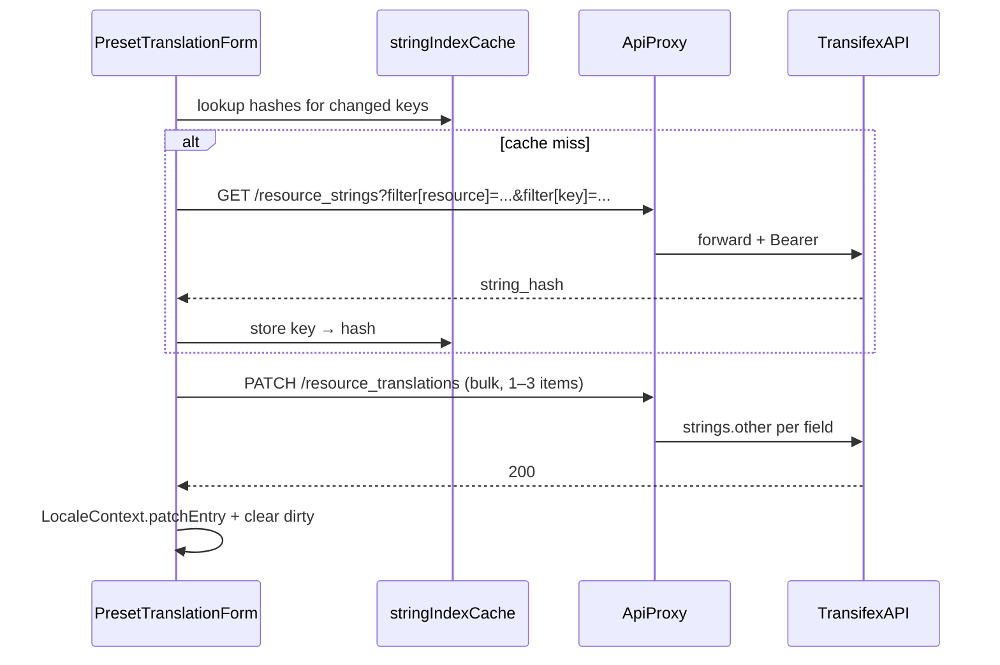

# Transifex inline translation editing

## Goal

Let translators edit **preset name, terms, and aliases** for the selected locale directly in this app and **persist to Transifex on Save**, without leaving the comparison UI.

## Current state

The app is **read-only** for translations:

- English loads with the schema via [`src/components/PagePresets/dataLoader.ts`](src/components/PagePresets/dataLoader.ts) → [`SchemaContext`](src/contexts/SchemaContext.tsx).
- Other locales load from `dist/translations/{locale}.min.json` via [`useLocaleData.ts`](src/components/PageTranslations/useLocaleData.ts) → [`LocaleContext`](src/contexts/LocaleContext.tsx).
- [`PageTranslations.tsx`](src/components/PageTranslations/PageTranslations.tsx) compares EN vs locale in `AttrRow` (plain `<span>` text). The only external action today is a Google Translate deep link.

There is **no Transifex code** in the repo yet. The app is a **static SPA** deployed to GitHub Pages ([`vite.config.ts`](vite.config.ts), [`.github/workflows/deploy-pages.yml`](.github/workflows/deploy-pages.yml)).

## Transifex target (verified via schema-builder v6.5.1)

OSM preset translations live in the iD editor Transifex project. [`@ideditor/schema-builder` `lib/translations.js`](https://github.com/ideditor/schema-builder/blob/v6.5.1/lib/translations.js) uses:

| Setting | Value |
|---------|-------|
| Organization slug | `openstreetmap` |
| Project slug (API) | `intrepid` (UI: [id-editor](https://app.transifex.com/openstreetmap/id-editor/)) |
| Resource slug | `presets` |
| Resource ID | `o:openstreetmap:p:intrepid:r:presets` |

### String keys (confirmed from build output shape)

[`schema-builder` `lib/build.js`](https://github.com/ideditor/schema-builder/blob/v6.5.1/lib/build.js) builds `source_strings.yaml` as `{ en: { presets: tstrings } }` where `tstrings.presets[id]` holds `name`, `terms`, `aliases`. Transifex keys are the flattened YAML paths:

```
presets.presets.{presetId}.name
presets.presets.{presetId}.terms
presets.presets.{presetId}.aliases
```

Examples:

- `amenity/cafe` → `presets.presets.amenity/cafe.name`
- `highway/living_street` → `presets.presets.highway/living_street.name`

**Inherited presets** (`"name": "{other/preset}"` in source JSON): schema-builder does **not** upload separate strings for that preset id — translations live on the referenced preset. The app's [`denormalize.ts`](src/components/PagePresets/denormalize.ts) resolves refs for display only. For v1: detect inherited presets (no own Transifex keys) and show read-only localized column with a link: *"Translations inherited from `{ref}` — edit there"*.

### Locale code mapping (confirmed)

From schema-builder `translations.js`:

- **App / dist files** use hyphens: `de`, `pt-BR`, `zh-CN`
- **Transifex API** uses underscores in language IDs: `l:de`, `l:pt_BR`, `l:zh_CN`

```ts
// app → API
export function toTransifexLang(locale: string): string {
  return `l:${locale.replace(/-/g, "_")}`;
}
// API → app (from l:pt_BR)
export function fromTransifexLang(id: string): string {
  return id.replace(/^l:/, "").replace(/_/g, "-");
}
```

### Serialization (round-trip with useLocaleData.ts)

| Field | Dist / Transifex storage | UI editing |
|-------|--------------------------|------------|
| `name` | plain string | `<input>` |
| `terms` | comma-separated, lowercased | textarea; split/join like `parseTerms()` |
| `aliases` | newline-separated | textarea, one per line |

**Note:** Transifex download processing may split a multi-line `name` into `name` + `aliases` when building dist files. We always PATCH the three separate keys above — do not merge aliases into `name` on save.

## Transifex API v3

- **Base:** `https://rest.api.transifex.com`
- **Auth:** `Authorization: Bearer <token>` ([user API settings](https://www.transifex.com/user/settings/api/))
- **Headers:** `Accept` and `Content-Type`: `application/vnd.api+json` (bulk PATCH adds `;profile="bulk"`)
- **Rate limit:** 500 req/min (use bulk PATCH for 3 fields per preset)

### Save flow



### Endpoints

**1. Resolve string hash** (cache per key, fetch on save if missing):

```
GET /resource_strings
  ?filter[resource]=o:openstreetmap:p:intrepid:r:presets
  &filter[key]=presets.presets.amenity/cafe.name
```

Response `data[0].attributes.string_hash` and `data[0].id` (`...:s:{hash}`).

**2. Write translation(s)** — prefer bulk for one preset save:

```
PATCH /resource_translations
Content-Type: application/vnd.api+json;profile="bulk"

{
  "data": [{
    "type": "resource_translations",
    "id": "o:openstreetmap:p:intrepid:r:presets:s:{hash}:l:de",
    "attributes": { "strings": { "other": "Café" } }
  }]
}
```

- Non-plural strings: only `other` key required.
- Clear translation: `"strings": { "other": null }`
- Do **not** send `reviewed: true` for contributor edits (modified strings default to unreviewed).

**3. Test connection** (on Connect click):

```
GET /projects/o:openstreetmap:p:intrepid
```

401 → invalid token; 403 → not a project member.

### Spike commands (run before UI work)

Replace `$TOKEN` and verify one preset in a test locale:

```bash
# Resolve string
curl -s -H "Authorization: Bearer $TOKEN" \
  -H "Accept: application/vnd.api+json" \
  "https://rest.api.transifex.com/resource_strings?filter%5Bresource%5D=o:openstreetmap:p:intrepid:r:presets&filter%5Bkey%5D=presets.presets.amenity/cafe.name"

# PATCH translation (use hash from above)
curl -s -X PATCH \
  -H "Authorization: Bearer $TOKEN" \
  -H "Content-Type: application/vnd.api+json" \
  -H "Accept: application/vnd.api+json" \
  -d '{"data":{"type":"resource_translations","id":"o:openstreetmap:p:intrepid:r:presets:s:HASH:l:de","attributes":{"strings":{"other":"TEST"}}}}' \
  "https://rest.api.transifex.com/resource_translations/o:openstreetmap:p:intrepid:r:presets:s:HASH:l:de"
```

Revert test string in Transifex UI after spike.

## Security and proxy (required)

Transifex tokens must not be embedded in the static bundle. Browser writes go through a **forwarding proxy** ([Transifex OAuth/proxy guidance](https://developers.transifex.com/docs/developing-oauth-applications)).

### Phase 1 — local dev

[`vite.config.ts`](vite.config.ts) — add dev proxy:

```ts
server: {
  proxy: {
    "/api/transifex": {
      target: "https://rest.api.transifex.com",
      changeOrigin: true,
      rewrite: (path) => path.replace(/^\/api\/transifex/, ""),
    },
  },
},
```

`.env.local` (gitignored, add `.env.example` committed):

```
VITE_TRANSIFEX_PROXY=/api/transifex
# Optional dev convenience — pre-fills connect panel, never commit real token
VITE_TRANSIFEX_TOKEN=
```

### Phase 2 — production

Add `workers/transifex-proxy.ts` (Cloudflare Worker or similar):

- `GET|PATCH|POST` on `/api/transifex/*` → forward to `https://rest.api.transifex.com/*`
- Pass through `Authorization` header from client
- CORS: allow `https://osmberlin.github.io` (+ `localhost` for dev)
- No token logging or persistence
- Deploy separately; set `VITE_TRANSIFEX_PROXY` to worker URL at build time

Until the worker is deployed, editing works in **dev only**; production shows connect panel with "proxy not configured" message.

## Architecture

### New modules

```
src/transifex/
  config.ts           # RESOURCE_ID, project constants
  keys.ts             # presetFieldKey(presetId, 'name'|'terms'|'aliases')
  localeMap.ts        # toTransifexLang / fromTransifexLang
  serialize.ts        # LocaleEntry ↔ API string values
  types.ts            # JsonApiResponse, ResourceString, ApiError
  client.ts           # transifexFetch(path, { method, body, token })
  stringIndex.ts      # Map<transifexKey, stringHash> + resolveHashes(keys[])
  transifexUrl.ts     # deep link to Transifex web editor for a key

src/stores/transifexStore.ts   # token (sessionStorage), status, hash cache
src/contexts/TransifexContext.tsx  # exposes connect(), save(), canEdit

src/components/PageTranslations/
  TransifexConnectPanel.tsx
  PresetTranslationForm.tsx
  TranslationField.tsx           # thin input/textarea wrapper
```

### Client helper (sketch)

```ts
const PROXY = import.meta.env.VITE_TRANSIFEX_PROXY ?? "/api/transifex";

export async function transifexFetch<T>(
  path: string,
  { token, method = "GET", body }: { token: string; method?: string; body?: unknown },
): Promise<T> {
  const res = await fetch(`${PROXY}${path}`, {
    method,
    headers: {
      Accept: "application/vnd.api+json",
      Authorization: `Bearer ${token}`,
      ...(body ? { "Content-Type": "application/vnd.api+json" } : {}),
    },
    body: body ? JSON.stringify(body) : undefined,
  });
  if (!res.ok) throw await parseTransifexError(res);
  return res.status === 204 ? undefined : res.json();
}
```

### LocaleContext extension

[`LocaleContext.tsx`](src/contexts/LocaleContext.tsx) currently derives `localeMap` read-only from fetch. Changes:

1. Move `useLocaleTranslations` state up or add `patchEntry(presetId, partial: Partial<LocaleEntry>)` that merges into the in-memory map.
2. Expose `reloadLocale()` to re-fetch after save if needed (fallback; optimistic patch is primary).

```ts
patchEntry: (presetId: string, entry: Partial<LocaleEntry>) => void
```

### Transifex store

```ts
type TransifexStore = {
  token: string | null;           // sessionStorage key: transifex_token
  status: "disconnected" | "connecting" | "connected" | "error";
  error: string | null;
  setToken: (t: string | null) => void;
  testConnection: () => Promise<boolean>;
};
```

On mount: read token from `sessionStorage`; if `VITE_TRANSIFEX_TOKEN` set (dev), pre-fill.

### Save hook

`useTransifexSave(presetId, locale)`:

1. Compare draft vs `localeMap.get(presetId)` → changed fields only
2. `resolveHashes(changedKeys)` via string index
3. Build bulk PATCH payload (max 3 items)
4. On success: `patchEntry`, toast/status, clear dirty
5. On 404 for key: surface "string not in Transifex (new preset?)"
6. On 429: exponential backoff, retry once

## UI design

### v1 scope

- **Fields:** preset `name`, `terms`, `aliases` only
- **Pages:** [`PageTranslations.tsx`](src/components/PageTranslations/PageTranslations.tsx) list cards + [`PresetDetailModal.tsx`](src/components/PagePresets/PresetDetailModal.tsx) translation section
- **Gate:** locale selected + Transifex connected + proxy reachable

### Per-preset card (PageTranslations)

Replace localized column in `AttrRow` when `canEdit`:

| Column | English (read-only) | Locale (editable) |
|--------|---------------------|-------------------|
| Name | span | `TranslationField` input |
| Terms | TermChips | textarea (comma-separated on save) |
| Aliases | text | textarea (newline-separated) |

Footer row per card:

- **Save to Transifex** — enabled when dirty + connected; shows spinner while saving
- **Open in Transifex ↗** — `https://app.transifex.com/openstreetmap/id-editor/translate/#${txLang}/presets/?q=key:${key}`
- Keep existing **GT ↗** link

### Connect panel ([`TranslationsSidebar.tsx`](src/components/PageTranslations/TranslationsSidebar.tsx))

New `SidebarSection` above translation status:

- Password input + Connect / Disconnect
- Status indicator (green/amber/red)
- Short help: *"Requires Transifex membership on the [iD Editor project](https://app.transifex.com/openstreetmap/id-editor/). Generate an API token in [user settings](https://www.transifex.com/user/settings/api/)."*
- Warning: *"Saves go to live Transifex, not the loaded schema dist."*

### PresetDetailModal

Replace `TranslationRow` localized cell with shared `PresetTranslationForm` (compact variant, same save logic).

## File change manifest

| File | Change |
|------|--------|
| `vite.config.ts` | Dev proxy `/api/transifex` |
| `.env.example` | Document `VITE_TRANSIFEX_PROXY`, `VITE_TRANSIFEX_TOKEN` |
| `.gitignore` | Ensure `.env.local` covered (already via `*.local`) |
| `src/transifex/*` | New API client layer |
| `src/stores/transifexStore.ts` | Token + connection state |
| `src/contexts/TransifexContext.tsx` | Provider wrapping app (inside `LocaleProvider` in [`router.tsx`](src/router.tsx)) |
| `src/contexts/LocaleContext.tsx` | `patchEntry`, optional `reloadLocale` |
| `src/components/PageTranslations/TransifexConnectPanel.tsx` | New |
| `src/components/PageTranslations/PresetTranslationForm.tsx` | New |
| `src/components/PageTranslations/TranslationsSidebar.tsx` | Mount connect panel |
| `src/components/PageTranslations/PageTranslations.tsx` | Editable localized column + save |
| `src/components/PagePresets/PresetDetailModal.tsx` | Reuse form in translation section |
| `workers/transifex-proxy.ts` | Optional production forwarder |
| `README.md` | Short "Editing translations" section (proxy setup, token, limitations) |
| `tests/unit/transifex/*.test.ts` | serialize, keys, localeMap |
| `tests/e2e/transifex.spec.ts` | Optional mocked proxy |

## Edge cases

| Case | Handling |
|------|----------|
| Inherited preset (`{ref}`) | Read-only; link to referenced preset's translation keys |
| String missing in Transifex | 404 on GET; message "not in Transifex yet" |
| 401 / 403 | Clear connected state; prompt re-auth / join project |
| 429 throttled | Retry once after `Retry-After`; show "rate limited" |
| Empty name cleared | PATCH `other: null` |
| Terms-only translation | Allow save without name |
| PR preview `dataUrl` | Banner: edits affect live Transifex, not PR dist |
| No proxy in production build | Connect panel explains; inputs disabled |
| English locale selected | No edit UI (EN is source in repo, not Transifex) |

## Testing and acceptance criteria

### Unit tests

- `keys.presetFieldKey('amenity/cafe', 'name')` → `presets.presets.amenity/cafe.name`
- `serialize.termsToApi(['a','B'])` → `'a,b'`
- `serialize.aliasesToApi(['A','B'])` → `'A\nB'`
- `localeMap.toTransifexLang('pt-BR')` → `l:pt_BR`

### Manual acceptance

1. `bun run dev` with token in `.env.local`
2. Select locale `de`, connect Transifex
3. Edit a preset name on Translations page, Save
4. Verify string updated in [Transifex UI](https://app.transifex.com/openstreetmap/id-editor/)
5. Reload page — dist JSON still shows old value until next schema release (expected); optimistic UI shows new value immediately
6. Open same preset in PresetDetailModal — form shows saved draft

### Optional E2E

Playwright `page.route('**/api/transifex/**')` mock GET/PATCH; assert Save enables on input change and PATCH body contains correct `id` suffix.

## Implementation order

1. **Spike** — curl or small script validates keys + PATCH against real Transifex
2. **`src/transifex/` + Vite proxy** — client + string index
3. **`transifexStore` + `TransifexContext` + connect panel**
4. **`PresetTranslationForm` + `LocaleContext.patchEntry`**
5. **Wire `PageTranslations`** then **`PresetDetailModal`**
6. **Production worker** + README note
7. **Unit tests** + inherited-preset handling

## Out of scope for v1

- Editing English source strings (live in id-tagging-schema JSON)
- Field labels, categories, deprecated strings (other Transifex namespaces)
- OAuth login (token paste is sufficient for contributors)
- Auto-refreshing dist JSON from Transifex after save
- Review/proofread workflow in UI
- Batch-editing multiple presets in one save

## Default decisions (applied)

| Decision | Choice |
|----------|--------|
| Auth | User-pasted API token in `sessionStorage` |
| API access | Dev Vite proxy + optional Cloudflare Worker for production |
| Editable scope | Preset name, terms, aliases on Translations page + PresetDetailModal |
| Save granularity | Per-preset card, bulk PATCH up to 3 fields |
| Review status | Do not auto-mark reviewed |
